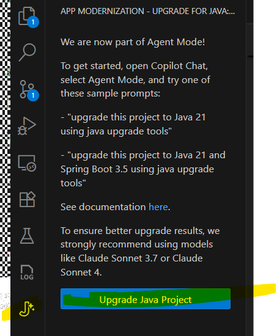

# Step 1: Set up your development environment
1. Install the extension GitHub Copilot app modernization - upgrade for Java 
2. Install Java 8 / Java 11 / Java 17 and 21 versions.
3. Set up your IDE (e.g., VS Code, IntelliJ IDEA, Eclipse)
4. Clone the repository `git clone https://github.com/org/java-repo.git` or open existing project in your IDE
5. Change the project directory and open **java-8-legacy-app** in your IDE
6. Build the project using Maven or Gradle
`cd java-8-legacy-app && mvn clean install -U`
7. Ignore test failures
8. Run the application
`mvn spring-boot:run -Dmaven.test.skip=true`
9. Access the application at `http://localhost:8080`

# Step 2: Upgrade Steps

1. Click on the extension icon GitHub Copilot app modernization - upgrade for Java and follow the prompts to upgrade your application.

2. click on Upgrade Java Project button, follow the prompts to complete the upgrade. 

OR Open Copilot chat in agent mode and enter your prompt like "Upgrade this Java application to Java 21 version and Spring boot to 3.5 using java upgrade tools"

3. Reference [GitHub Copilot App Modernization - upgrade for Java](https://learn.microsoft.com/en-us/java/upgrade/overview)

# Step 3: Post-Upgrade Steps

1. Verify the pom.xml & application functionality after the upgrade.
2. Run the application using Java 21
